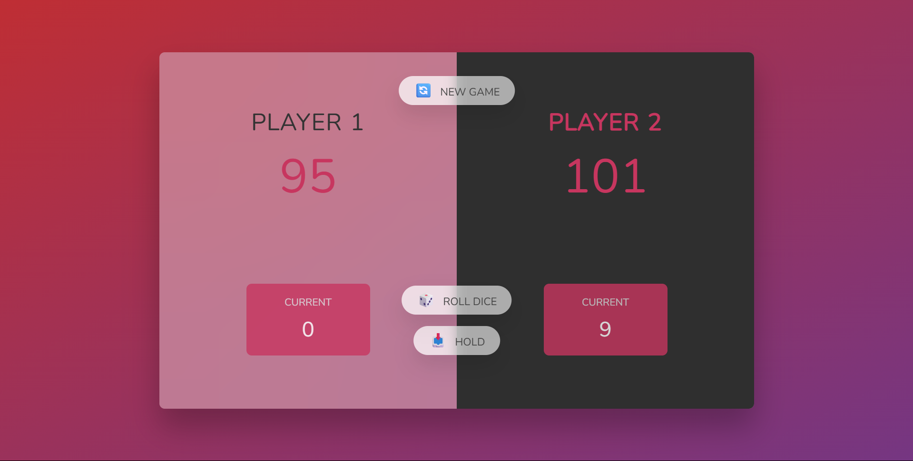

# 🎲 Pig Game

This is a simple dice game called **Pig Game**, developed as part of my JavaScript learning journey. It’s my **second experience working with the DOM**, and I built this game to practice interacting with web page elements using JavaScript.

## 🕹️ How to Play

1. Two players take turns to roll a dice.
2. On each turn, the player can roll the dice as many times as they like:
   - Each roll (except 1) adds to their **current score**.
   - If the player rolls a **1**, they lose all points accumulated in that turn and it's the next player's turn.
3. The player can click **"Hold"** to add their current score to their **total score** and pass the turn.
4. The first player to reach **100 points** wins the game!
5. Click **"New Game"** to restart the game at any time.

## 🔧 Features

- Turn-based gameplay with real-time score updates.
- Dynamic UI updates and player switching.
- Dice images update visually on each roll.
- Game reset and winner indication.

## 🛠️ Technologies Used

- **HTML5**
- **CSS3**
- **JavaScript (Vanilla)** — with DOM manipulation
- **Dice image assets** for visual feedback

## 📚 Notes

This is my **second experience working with the DOM** as part of my journey in learning JavaScript. The goal of the project was to improve my understanding of event handling, UI updates, and game logic using only plain JS.

## 🔗 Live Demo

- https://baselelsrogy.github.io/pig-dice-game/

## 📷 Preview

